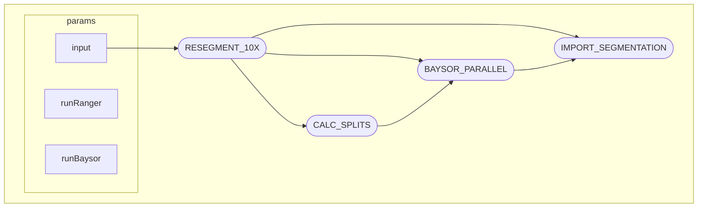

# Xen_Segmentation_NextFlow
A custom Nextflow pipeline for generating alternative cell segmentations for 10x Xenium spatial transcriptomic data

> [!NOTE]
> This is workflow follows SOME but NOT ALL of the nf-core template/guidelines. It's really just a custom Nextflow built for specific needs

## Overivew 
This workflow allows for re-segmenting 10x Xenium data via:

- Alternative settings from `xeniumranger resegment`
    - i.e. DAPI/nuclear only
- Baysor (https://github.com/kharchenkolab/Baysor)

## Features

Transcript inputs for Baysor are split into relatively even sized "chunks" and run in parrallel. 

This **greatly improves runtime** for large Xenium experiments at the cost of some oversegmentation for cells found along chunk boundaries
 
## Workflow DAG

### Baysor Parallel DAG

