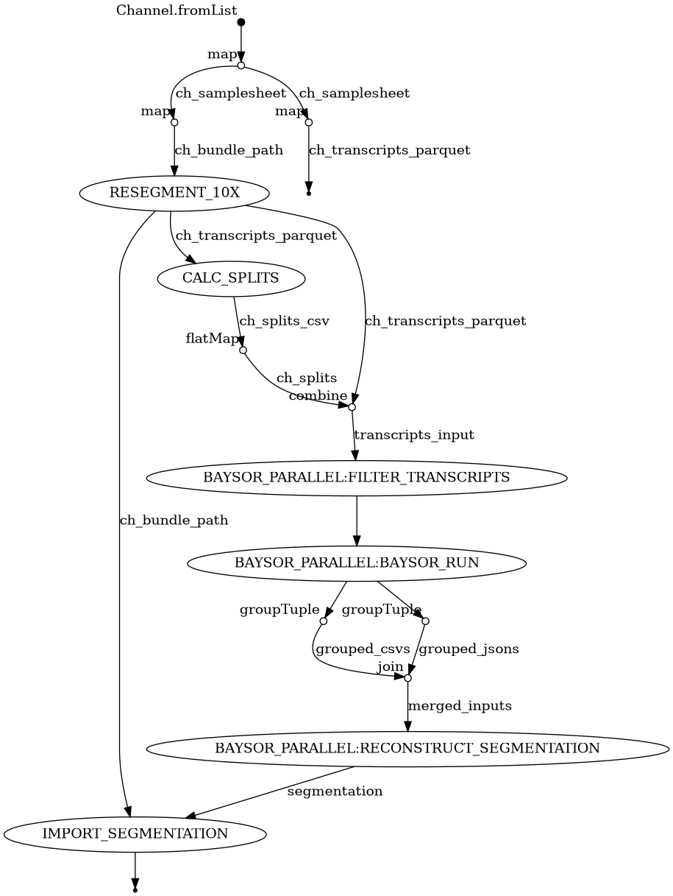

# Xen_Segmentation_NextFlow
A custom Nextflow pipeline for generating alternative cell segmentations for 10x Xenium spatial transcriptomic data

> [!NOTE]
> This is **NOT** intended to be a modular/nf-core-templated workflow. Just a custom Nextflow built for specific needs

## Overivew 
This workflow allows for re-segmenting 10x Xenium data via:

- Alternative settings from `xeniumranger resegment`
    - i.e. DAPI/nuclear only
- Baysor (https://github.com/kharchenkolab/Baysor)

## Features

Transcript inputs for Baysor are automatically split into relatively even sized "chunks" designed to keep numbers of transcripts even between them and then these chunks are run through baysor in parrallel. 

This **greatly improves runtime** for large Xenium experiments
 
## Workflow DAG

