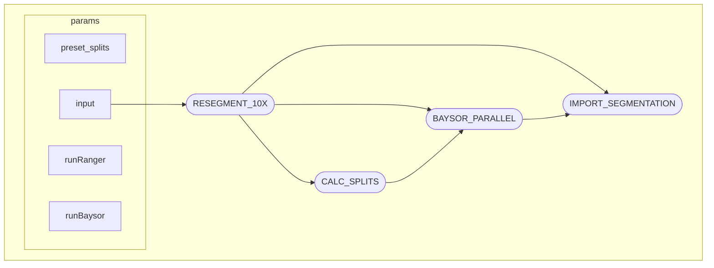
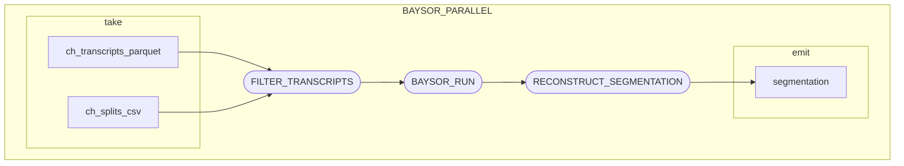

# Xen_Segmentation_NextFlow
A custom Nextflow pipeline for generating alternative cell segmentations for 10x Xenium spatial transcriptomic data

> [!NOTE]
> This is workflow follows SOME but NOT ALL of the nf-core template/guidelines. It's really just a custom Nextflow built for specific needs

## Overview 
This workflow allows for re-segmenting 10x Xenium data via:

- Alternative settings from `xeniumranger resegment`
    - i.e. DAPI/nuclear only
- Baysor (https://github.com/kharchenkolab/Baysor)

## Features

### Baysor Parallel

Transcript inputs for Baysor are automatically split into relatively even sized "chunks" of transcripts and run in parallel. 

This **greatly improves runtime** for large Xenium experiments at the cost of some oversegmentation for cells found along chunk boundaries. If this is a concern, one solution is to manually assign pre-set chunk coordinates around tissue boundaries. 

## Installation

This pipeline uses the MTA_pipeline3 docker image. 

See ./docker for dockerfile

## Usage

### To Run

```
nextflow run main.nf \
    --input ./samplesheet.csv
```

#### Sample Sheet

The pipeline takes as input a nf-core/spatialxe style samplesheet. With one additional column specified for pre-determined parallel splits. 

Example:
```csv
sample,bundle,image, splits
breast_cancer,/path/to/xenium/bundle,/path/to/morphology.ome.tif, /path/to/predefined/splits.csv
```

See config for pipeline options!

#### Predefined Splits

If using preset chunks the `splits.csv` file should contain the following columns:
- `tile_id`: Unique identifier for each tile
- `x_min`, `x_max`: X-axis boundaries
- `y_min`, `y_max`: Y-axis boundaries

Example:
```csv
tile_id,x_min,x_max,y_min,y_max
tile1,0,1000,0,1000
tile2,1000,2000,0,1000
```

## Recommendations

The baysor segmentation takes into account priors from Xenium segmentation run by either Onboard Analyzer or XeniumRanger.

In practice **it is best to use DAPI-based nuclear segmentation as the priors** for baysor

> [!NOTE]
> You can set the `baysor_prior` parameter to 0 to ignore these prior segmentation attempts. 

## Workflow DAG



### Baysor Parallel DAG

